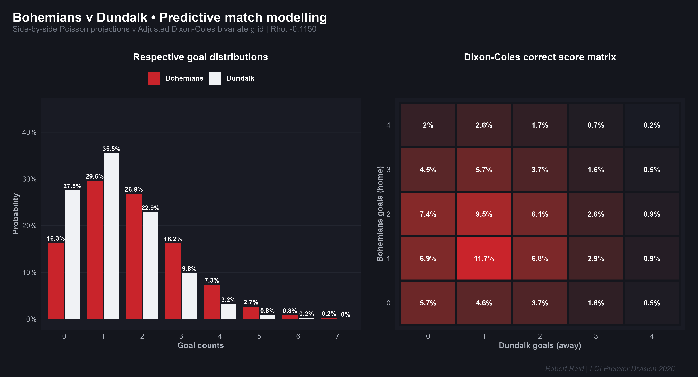

# Match preview: Bohemians v Dundalk

When Bohemians and Dundalk last met at Dalymount Park in the league (20 March 2026), the game ended in a 1-1 draw. 

Interestingly, our Dixon-Coles model predicts another 1-1 draw when the sides renew acquaintances at the Phibsborough venue on Friday, 19 June 2026 (7.45pm) in the League of Ireland’s Premier Division.

**Key Insight:** Even the most likely outcome (11.7%) is not that likely. The Dixon-Coles model treats goal scoring as a random process governed by a Poisson distribution, adjusted for team strengths. In a low-scoring sport like football, a single goal can define the outcome of the game, as matches average only two to three goals in total.

Because a single goal makes up such a huge part of the final score, one lucky or unlucky moment can completely change who wins. This makes football incredibly unpredictable. The model mathematically respects this variance by heavily spreading out its probabilities—hence the most likely outcome not being that likely at all. 

---

### Model mechanics & visuals
*The accompanying chart shows the respective goal distributions for both sides and the Dixon-Coles correct score matrix.* 

The Dixon-Coles matrix inflates the probabilities of low-scoring outcomes such as 0-0 and 1-1, which happen more often than a standard Poisson regression model typically predicts. Conversely, it deflates 1-0 and 0-1 scorelines, which a plain-vanilla Poisson generally overstates.

---

### Odds & market probability analysis

Based on the probabilities derived from the Dixon-Coles model, **Bohemians are the favourites to win**. However, a comparison with the market reveals significant bookmaker overround.

| Outcome | Fair Odds (Model) | Implied Prob. (Model) | Paddy Power Odds | Implied Prob. (Market) |
| :--- | :---: | :---: | :---: | :---: |
| **Bohemians Win** | 2.07 | 48.31% | 1.80 | 55.56% |
| **Dundalk Win** | 3.83 | 26.11% | 3.70 | 27.03% |
| **Draw** | 3.93 | 25.45% | 3.70 | 27.03% |
| **Total Book** | — | **100.00%** | — | **109.62%** |

#### Market Takeaway
Paddy Power’s total book stands at 109.62%, meaning they have built a sizeable overround (vig) of 9.62% into this specific market. 

Because the Dixon-Coles model aligns closely with Paddy Power’s prices on the draw and Dundalk—while Paddy Power heavily overstates Bohemians’ chances—our calculated percentages appear to be absorbed by that massive 9.62% house edge. Efficiently-priced markets with heavy overrounds are mathematically unbeatable over the long term.

---

### 📋 Note on model parameters
A time-decay factor was intentionally omitted from this run. Because the 2026 League of Ireland season only kicked off in February—with just 101 of the 180 total games played to date—the sample size is fresh enough that artificially discounting early-season data would introduce unnecessary noise rather than predictive signal.
